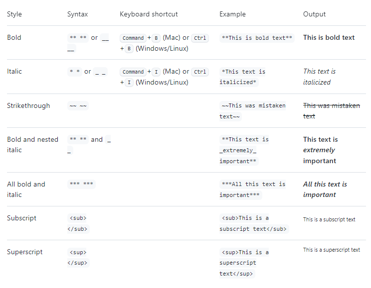

# Reading Assignment 1 Notes

[The Markdown Guide](https://www.markdownguide.org/basic-syntax/)

[Basic Syntax](https://docs.github.com/en/get-started/writing-on-github/getting-started-with-writing-and-formatting-on-github/basic-writing-and-formatting-syntax)

Use [GitHub](https://pages.github.com/) pages to build websites easily!

Some basic ways to format [Markdown](https://docs.github.com/en/get-started/writing-on-github/getting-started-with-writing-and-formatting-on-github/basic-writing-and-formatting-syntax)

---

[Back to Home](../README.md)
