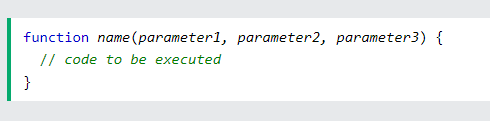
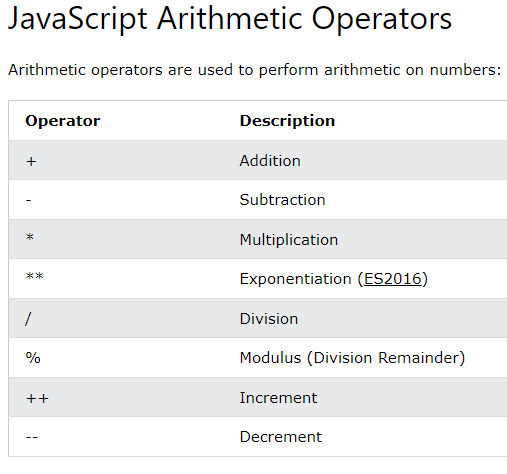
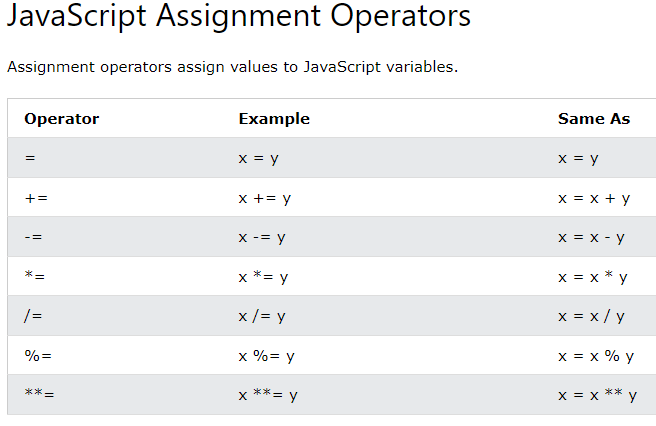
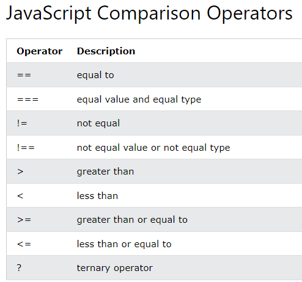
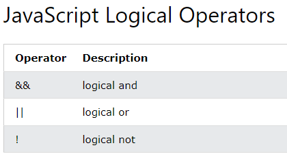

# Reading Assignment 7

## Control Flow

the order in which the computer executes statements in a script.

## JS Functions

### Syntax

Variables declared in a function become local to that function

## JS Operators

Adding JS strings is called concatenation

### Resources

[Control Flow](https://developer.mozilla.org/en-US/docs/Glossary/Control_flow)

[JS Functions](https://www.w3schools.com/js/js_functions.asp)

[JS Operators](https://www.w3schools.com/js/js_operators.asp)

---

[Back to Home](../README.md)
