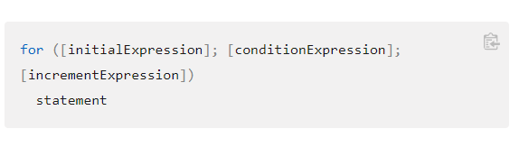
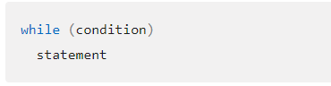

# Reading Assignment 8

## JS Assignment Operators

An assignment operator assigns a value to its left operand based on the value of its right operand. The simple assignment operator is equal (=), which assigns the value of its right operand to its left operand

For more assignment operators go to [reading assignment 7](read-7.md)

## JS Comparison Operators

A comparison operator compares its operands and returns a logical value based on whether the comparison is true

For more comparison operators go to [reading assignment 7](read-7.md)

## "For" Loop

A for loop repeats until a specified condition evaluates to false

Syntax

## "While" Loop

A while statement executes its statements as long as a specified condition evaluates to true

Syntax

Avoid infinite loops. Make sure the condition in a loop eventually becomes false—otherwise, the loop will never terminate

---

### Resources

[Expressions and Operators](https://developer.mozilla.org/en-US/docs/Web/JavaScript/Guide/Expressions_and_Operators#comparison_operators)

[Loops and Iteration](https://developer.mozilla.org/en-US/docs/Web/JavaScript/Guide/Loops_and_iteration)

---

[Back to Home](../README.md)