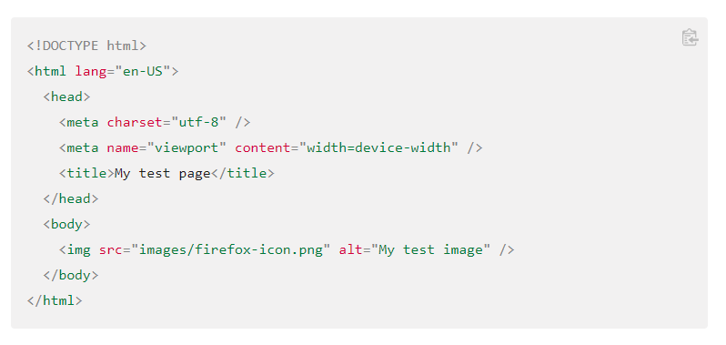
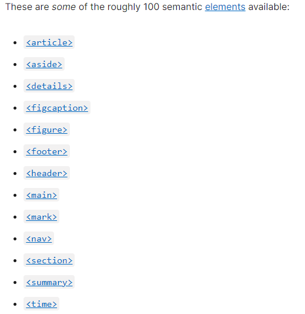

# Reading Assignment 4

## Wireframing

There are heaps of free wireframe tools out there but don’t forget that you can also just use pen and paper! 

*three online tools*

- UXPin
- InVision
- Wireframe.cc

## HTML Basics

- The content of your webpage
- Opening tag & closing tags
- elements can have attributes
- There can be self closing tags

### Anatomy of an HTML Document

### Semantic examples

## Resources

[html resource one](https://developer.mozilla.org/en-US/docs/Learn/Getting_started_with_the_web/HTML_basics)

[html resource two](https://developer.mozilla.org/en-US/docs/Glossary/Semantics)

[html resource 3](https://developer.mozilla.org/en-US/docs/Web/HTML)

[html resource 4](https://developer.mozilla.org/en-US/docs/Web/HTML/Element)

---

[Back to Home](../README.md)