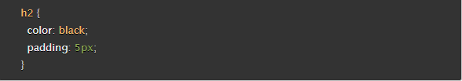

# Class 2 Reading Notes

## HTML Text Fundamentals and Advanced Formatting

1. It is important to use semantic elements in our HTML because it'll help us and the web browser know what type of content is supposed to be nested in the elements

2. There are 6 levels of heading in HTML

3. Some uses for the sup and sub-elements are for dates, chemical formulae, and mathematical equations

4. When using the abbr element in HTML you must add plain text of the full expansion of the term the first time to inform users what the abbreviation means

## How CSS is Structured

1. Ways to apply CSS to HTML are in-line code, external stylesheets, and internal stylesheets

2. We should avoid using in-line styling because it makes our code hard to read and less efficient for changes

3. 

1. h2 is the CSS selector

2. A CSS declaration block is everything in the {}

3. Color and Padding are CSS properties

## JS Bsics

1. A string is a datatype that is text surrounded by quotation marks

2. 4 JS Operators: + addition , - subtraction , / division , * multiplication

3. Using a JS function you could solve addition problems with a sum function that adds 2 parameters together

## Conditionals

1. An if statement checks a condition and if it evaluates to true, then the code block will execute.

2. Else if is used when you want multiple conditions checked

3. 3 comparison operators: === strictly equals, ==! strictly doesn't equal, and < less than

4. the `&&` operator = and the `||` operator = or

## Things I want to know more about

- Aligning things in CSS

---

### Resources

[HTML Text Fundamentals](https://developer.mozilla.org/en-US/docs/Learn/HTML/Introduction_to_HTML/HTML_text_fundamentals)

[Advanced Text Formatting](https://developer.mozilla.org/en-US/docs/Learn/HTML/Introduction_to_HTML/Advanced_text_formatting)

[How CSS is Structured](https://developer.mozilla.org/en-US/docs/Learn/CSS/First_steps/How_CSS_is_structured)

[JS Basics](https://developer.mozilla.org/en-US/docs/Learn/Getting_started_with_the_web/JavaScript_basics)

[JS Conditionals](https://developer.mozilla.org/en-US/docs/Learn/JavaScript/Building_blocks/conditionals)

---

[Back to Home](../README.md)
