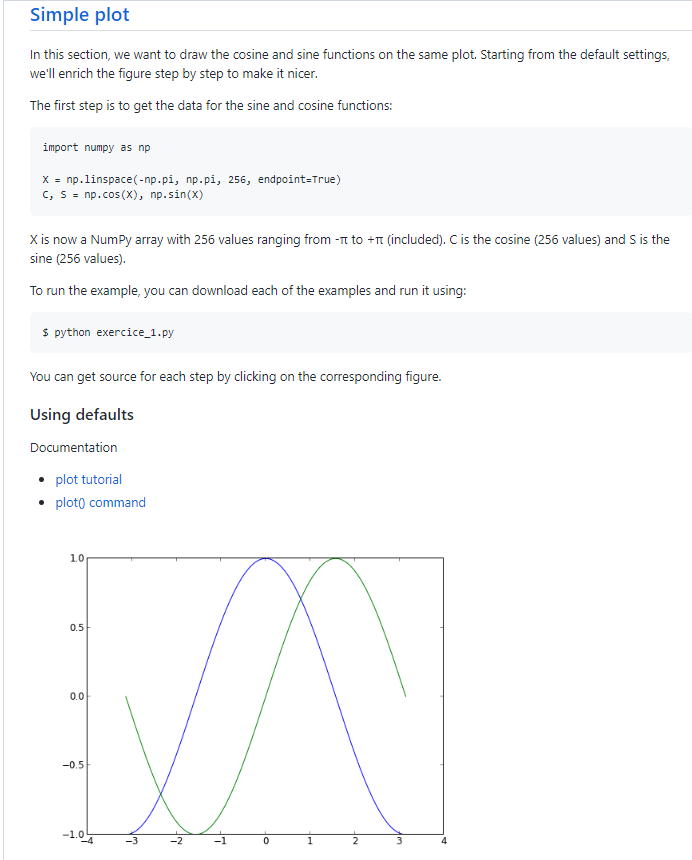

# Class 14 Reading Notes

## Matplotlib

- matplotlib is probably the single most used Python package for 2D-graphics.

- IPython is an enhanced interactive Python shell that has lots of interesting features including named inputs and outputs, access to shell commands, improved debugging and much more. It allows interactive matplotlib sessions that have Matlab/Mathematica-like functionality.

- pyplot provides a convenient interface to the matplotlib object-oriented plotting library.

### Simple Plot

---

### Resources

[MatPLotLib Tutorial](https://github.com/rougier/matplotlib-tutorial)

---

[Back to Home](../README.md)
