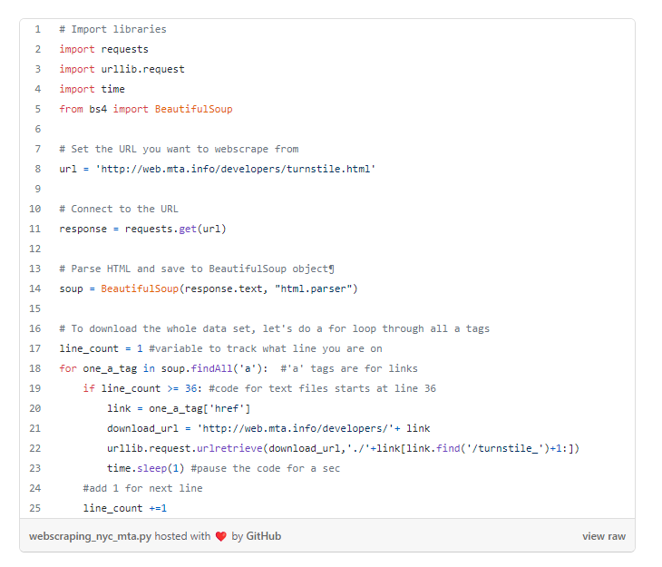

# Class 17 Reading Notes

## Web Scraping w/ Python

- Read through the website’s Terms and Conditions to understand how you can legally use the data. Most sites prohibit you from using the data for commercial purposes.
- The first thing that we need to do is to figure out where we can locate the links to the files we want to download inside the multiple levels of HTML
We start by importing the following libraries.

- import requests
- import urllib.request
- import time
- from bs4 import BeautifulSoup
- Next, we set the url to the website and access the site with our requests library.

- url = 'http://web.mta.info/developers/turnstile.html'
- response = requests.get(url)

---

### Resources

[IBM Serverless](https://www.ibm.com/topics/serverless)

---

[Back to Home](../README.md)
