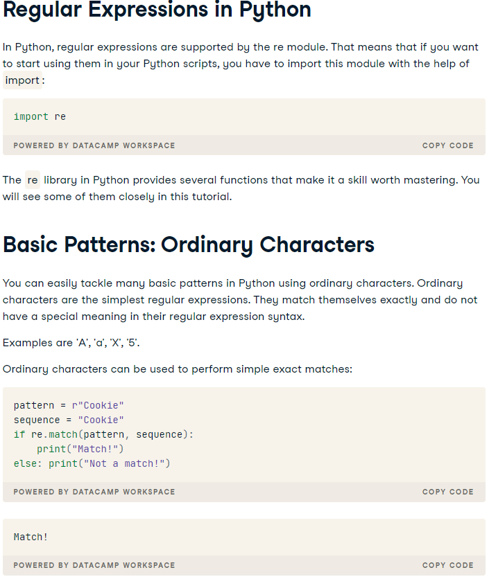
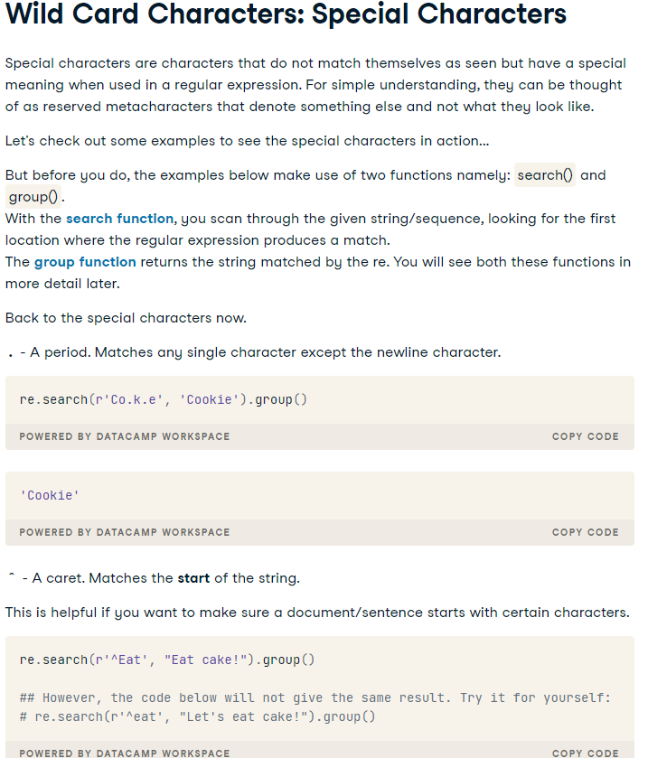

# Class 19 Reading Notes

## Pyhton Regex




- . A period. Matches any single character except the newline character.
- ^ A caret. Matches a pattern at the start of the string.
- \A Uppercase A. Matches only at the start of the string.
- $ Dollar sign. Matches the end of the string.
- \Z Uppercase Z. Matches only at the end of the string.
- [ ] Matches the set of characters you specify within it.
- \ ∙ If the character following the backslash is a recognized escape character, then the special meaning of the term is taken.
- ∙ Else the backslash () is treated like any other character and passed through.
- ∙ It can be used in front of all the metacharacters to remove their special meaning.
- \w Lowercase w. Matches any single letter, digit, or underscore.
- \W Uppercase W. Matches any character not part of \w (lowercase w).
- \s Lowercase s. Matches a single whitespace character like: space, newline, tab, return.
- \S Uppercase S. Matches any character not part of \s (lowercase s).
- \d Lowercase d. Matches decimal digit 0-9.
- \D Uppercase D. Matches any character that is not a decimal digit.
- \t Lowercase t. Matches tab.
- \n Lowercase n. Matches newline.
- \r Lowercase r. Matches return.
- \b Lowercase b. Matches only the beginning or end of the word.
- + Checks if the preceding character appears one or more times.
- * Checks if the preceding character appears zero or more times.
- ? ∙ Checks if the preceding character appears exactly zero or one time.
- ∙ Specifies a non-greedy version of +, *
- { } Checks for an explicit number of times.
- ( ) Creates a group when performing matches.
- < > Creates a named group when performing matches.

## Shutil

### Copying Files
copyfile() copies the contents of the source to the destination and raises IOError if it does not have permission to write to the destination file.

```Python
shutil_copyfile.py
import glob
import shutil

print('BEFORE:', glob.glob('shutil_copyfile.*'))

shutil.copyfile('shutil_copyfile.py', 'shutil_copyfile.py.copy')

print('AFTER:', glob.glob('shutil_copyfile.*'))
```

### Finding Files

The which() function scans a search path looking for a named file. The typical use case is to find an executable program on the shell’s search path defined in the environment variable PATH.

```Python
shutil_which.py
import shutil

print(shutil.which('virtualenv'))
print(shutil.which('tox'))
print(shutil.which('no-such-program'))
If no file matching the search parameters can be found, which() returns None.
```

$ python3 shutil_which.py

/Users/dhellmann/Library/Python/3.5/bin/virtualenv
/Users/dhellmann/Library/Python/3.5/bin/tox
None
which() takes arguments to filter based on the permissions the file has, and the search path to examine. The path argument defaults to os.environ('PATH'), but can be any string containing directory names separated by os.pathsep. The mode argument should be a bitmask matching the permissions of the file. By default the mask looks for executable files, but the following example uses a readable bitmask and an alternate search path to find a configuration file.

```Python
shutil_which_regular_file.py
import os
import shutil

path = os.pathsep.join([
    '.',
    os.path.expanduser('~/pymotw'),
])

mode = os.F_OK | os.R_OK

filename = shutil.which(
    'config.ini',
    mode=mode,
    path=path,
)

print(filename)
```

---

### Resources

[Python Regex](https://www.datacamp.com/community/tutorials/python-regular-expression-tutorial)

[Shutil Docs](https://pymotw.com/3/shutil/)

---

[Back to Home](../README.md)
