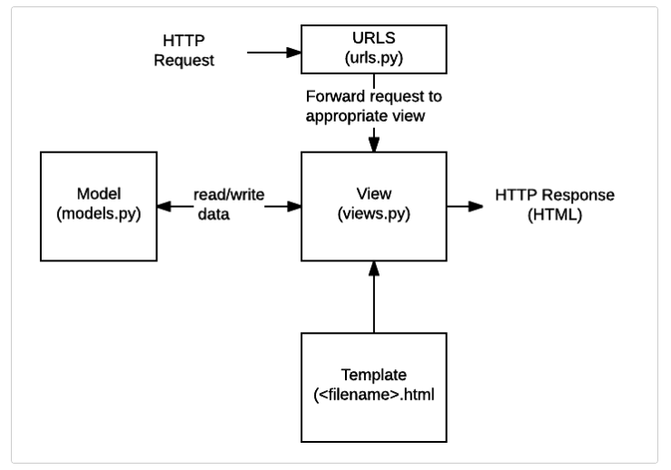

# Class 26 Reading Notes

## Starting Django

- you get a free database with Django
- Django handles urls paths in an easy to read format
- Django has an easy to learn template language
- Django provides a form library that renders forms as HTML and converts that data to Python types. It also provides a way to generate forms from your existing models.
- Django comes in with a built in authentication system.
- Django has an automatic admin interface.
- Django provides protection against Clickjacking, Cross-site scripting, Cross Site Request Forgery (CSRF), SQL injection and Remote code execution

## How Django Works

Django is a Python based web framework used by millions of devs and popular apps like Instagram.
Django’s code is open source and available to all. Django’s organization is managed by a non-profit, the DSF, with a miniscule budget. And Django code is lead by a core team of volunteers, two paid Django Fellows, and a larger group of contributors.

### Resources

[Getting Started w/ Django](https://www.djangoproject.com/start/)

[How Django Works Behind the Scenes](https://wsvincent.com/how-django-works-behind-the-scenes/)

---

[Back to Home](../README.md)
