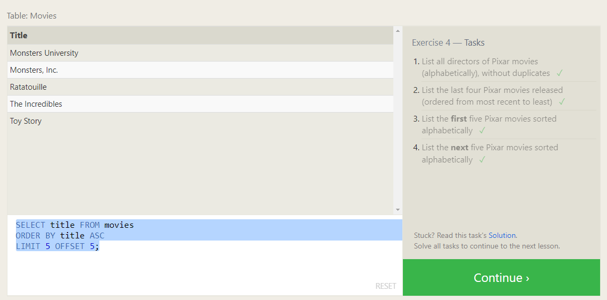

# SQL Practice

## Summary

SQL is a database with a specific schema all relating to eachother. The look like spreadhseets and can contain tons of information which is why you need to know how to target the items you want to manipulate in the database.

### Proof of Completion

---

[Back to Home](../README.md)
